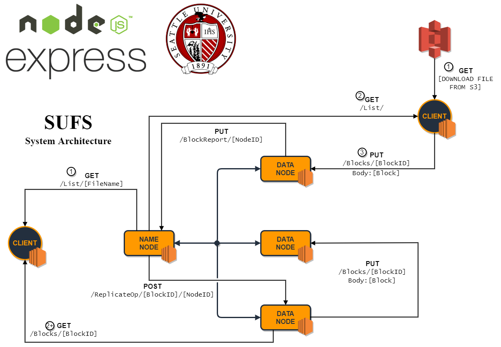

# SUFS

This is the **Seattle University File System** developed by **Team 5**


## Start Up

You will find npm start scripts that you can use in order to start each component of the SUFS.

The **NameNode** will expect no command line arguments:
    
```shell
npm run namenode
```

The **DataNode** will expect command line arguments of its `Node ID` its `publicIP`, and the `NameNode IP`:
    
```shell
npm run datanode 0 http://localhost:3000 http://localhost:8000
```

> **Note**: The blockID will offset its default port of 3000.(e.g Node 3 will be open on port 3003)

The **Client** will expect the `NameNode IP` in its command line arguments. 
    
```shell
npm run client http://localhost:8000
```

## Testing

In order to run the application you will need to install the AWS CLI and `configure` the account to use Mark Yu's account settings. Please contact Mark Yu for these credentials.  

## Using the Client

The client will print out instructions clearly and display errors appropriately. If any bugs are found please contact our developers. 

The client will save files from the S3 bucket into the directory `/s3Files/` and subsequently delete them after writing them into SUFS.

When the client reads files and blocks from SUFS it will write the files to the directory `/localFiles/`. The client will never clear this directory. 

Both of these folders are ignored by the git repository. 


## Architecture Diagram: 




## Team 5

Brought to you by these fantastic students:

- Isaac Ortega - *Designated Data Distributor*
- Mark Yu - *UX Expert*
- Rakan Alsagoor - *Metadata Master*
- Rohan Panuganti - *Deployment Wizard*

